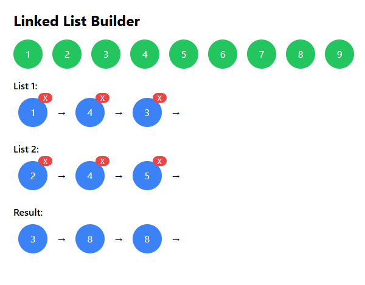

# Linked List UI React Project

## ✅ Features

- Drag-and-drop circles to build linked lists
- Animated transitions using Framer Motion
- Visual arrows between nodes
- Delete buttons
- Tailwind CSS styling
- State persistence with LocalStorage

## 🚀 Setup Instructions

1. Extract the zip file:
   ```bash
   unzip linked-list-ui-fixed.zip
   cd linked-list-ui-fixed
   ```
2. Install dependencies:
   ```bash
   npm install
   ```
3. Start development server:
   ```bash
   npm run dev
   ```
4. Open in browser:
   ```
   http://localhost:5173
   ```

## ✅ Requirements

- Node.js v16+

## ✅ Screenshots


